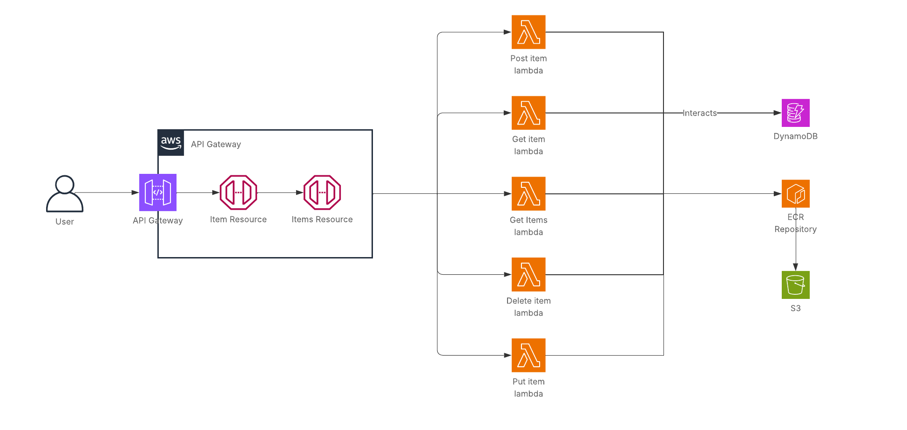

# Práctica 1 - Diseño de Aplicaciones en la Nube

**Autor:** Alejandro de Olózaga Ramírez

**Fecha:** Noviembre del 2025

## Parte 1 - Modelo acoplado (o monolito)

### Introducción
Esta es la primera parte de la práctica de la asignatura de Computación en la Nube, de la Universidad de Las Palmas de Gran Canaria. Consiste en desplegar una aplicación web robusta y escalable usando servicios de AWS. Se parte de una base con ficheros ``.yml`` que permite desplegar recursos para lograr un diseño monolito o acoplado. El diagrama de la infraestructura se presenta en la siguiente imagen:

La aplicación web que se despliega simula una lista de la compra donde se pueden añadir, editar, visualziar y eliminar elementos (operaciones CRUD). Cada elemento (o producto de compra) posee una categoría y una cantidad especificadas.

### Recursos y servicios
En este apartado se mostrarán y desglosarán los recursos y servicios utilizados en la infraestructua y sus conexiones.

#### API Gateway
Todo el conjunto del **API Gateway** sirve como una puerta de entrada segura y pública para la aplicación desplegada. En este caso, requiere la clave de la API para poder usar los métodos HTTP (``ApiKeyRequired: True``), así que el cliente (usuario) tendrá que ingresarla.

Se utiliza una **API REST**, que presenta una arquitectura con las siguientes características:
- Comunicación cliente-servidor con responsabilidades separadas: interfaz vs. almacenamiento y procesamiento de datos.
- Sin estado, el servidor no almacena información del cliente, por lo que cada petición tendrá que contener toda la información.
- Uso de recursos.
- Uso de métodos HTTP para comunicar con el servidor.

La API Gateway contiene dos recursos a los que accede para responder a las peticiones:
- **Items Resource**: colección de todos los elementos (productos de la compra).
- **Item Resource**: elemento específico de la colección.

Por último, el **VPC Link** es el componente que permite tener una conexión privada y segura con el balanceador de carga, que es privado. Al cerrar la infraestructura a una nube virtual privada (VPC) y restringir su acceso a Internet, se necesita puntos de acceso privados para acceder y conseguir que la aplicación web y las operaciones funcionen.

#### Load Balancer
El **balanceador de carga** consigue la distribución de carga, que permite que varios recursos trabajen de manera coordinada para atender peticiones de forma eficiente y evitar atascos o saturación de paquetes. En esta arquitectura se usa un balanceador de tipo red (_Network Load Balancer_), que está diesñado para proporcionar un rendimiento alto y asegurar baja latencia.

El recurso principal es el balanceador de carga de red, que mira la dirección IP y el puerto de la petición entrante. Este recusro es privado (``Scheme: internal``), solo se permite su acceso a través del VPC Link del API Gateway.

Todas las entradas se reciben por el **_Listener_** (oyente), que escucha por el puerto 8080 y acepta paquetes TCP (``Port: 8080 | Protocol: TCP``). Cuando recibe un paquete, lo reenvía directamente al grupo objetivo (_Target Group_).

El **grupo objetivo** es el conjunto de recursos o servicios a donde será dirigido el trabajo. Cuando sepa qué contenedores estén funcionando correctamente (marcados como _Healthy_), reenvía el paquete TCP a uno de esos contenedores.

#### ECS
El **_Elastic Container Service_** (ECS) permite el despligue y la gestión de contenedores Docker de forma escalable y eficiente. Dependiendo del modo de operación, también funciona como balanceador de carga sobre las instancias EC2 sobra las que trabaje, aunque no es en este caso. Básicamente, es la parte central de la infraestructrua, donde se ejecuta el código.

El **_ECS Cluster_** es un agrupamiento lógico, un espacio con un nombre donde se almacenarán los servicios y tareas a ejecutar.

La **definición de tarea** o (_task definition_) es el plano que usa el ECS para crear un contenedor, asignando CPU y memoria, permiso que poseerá la tarea cuando esté funcionando y la definición del contenedor.

El modo de operación es **FARGATE**, que es un servicio serverless, ya que no es necesaria la creación previa de instancias EC2, sino que, con la definición de tarea, el servicio lo crea. Esto conlleva que no se tenga que pagar por instancia EC2 creada en funcionamiento, sino por la tarea en funcionamiento.

El **_ECS Service_** es el componente que se encarga de mantener el estado deseado definido (``DesiredCount:``).

#### Endpoints
Los **_VPC Endpoints_** son puntos de contacto o comunicación que permiten disponer de un camino privado y directo entre una VPC y un servicio AWS evitando la salida a Internet. Los endpoints de tipo _gateway_ proporcionan una entrada en la tabla de rutas del VPC. Los endpoints de tipo _interface_ despliegan una Interfaz de Red Elástica (ENI) con dirección privada dentro del VPC.

Una interfaz de red elástica es una tarjeta de red virtual que permite a los recursos conectarse a una VPC. Y una VPC es una nube de red privada, así que, en el contexto de AWS, es sección privada y aislada dentro del centro de datos de AWS.

El **Endpoint para DynamoDB** permite la comunicación entre la aplicación y la base de datos. La definición de tarea lo usa cuando el código hace una llamada para modificar la base de datos (crear, ver, editar o eliminar un elemento).

El **Endpoint para la API de ECR** permite la autenticación y la comunicación del agente ECS con la API de ECR. Antes de descargar la imagen almacenada en el bucket del ECR, Fargate necesita un token de autorización y verificación de que la imagen existe.

El **Endpoint para el DKR de ECR** permite al cliente Docker descargar las capas de la imagen del contenedor. El ``ExecutionRoleArn`` es la conexión que transfiere los datos de la imagen a la tarea de Fargate.

El **Endpoint para el S3** permite acceder al bucket de S3 donde se almacena la imagen de Docker y así poder descargarla.

El **Endpoint para los registros de CloudWatch** permite enviar los registros del contenedor Fargate a CloudWatch, específicamente a la ruta ``/ecs/products``. 

#### Base de datos y ECR
DynamoDB es una base de datos noSQL totalmente gestionada por AWS. La decisión de usar esta base de datos se debe a la simplicidad de la aplicación web desplegada, ya que los accesos no requieren consultas complejas. Además, es escalable e ideal si tiene picos de tráfico al estar gestionada por AWS.

Su modo de facturación está definida por la propiedad ``BillingMode: PAY_PER_REQUEST`` y se encuentra configurada a demanda, es decir, por accesos.

El **registro de contenedores Docker** (_Elastic Container Registry_) es el servicio que almacena la imagen Docker después de construirla y antes de desplegarlo. En realidad, la imagen se almacena físicamente en un bucket de S3 (_Simple Storage Service_), que es un servicio de almacenamiento de objetos. Los buckets son los contenedores donde, efectivamente, se guardan esos objetos.
  
#### CORS
El CORS (_Cross-Origin Resource Sharing_) es el mecanismo de seguridad fundamental para las aplicaciones web. Es un conjunto de cabeceras HTTP que el servidor envía al navegador para asegurar la fiabilidad en el origen.

### Puesta en marcha
1) Crear una pila para el despliegue de un repositorio ECR en CloudFormation (archivo _ecr.yml_). En los parámetros se tiene que especificar:
    - Nombre de la pila.
    - Nombre de rol de IAM.

2) Crear una pila para el despliegue de la base de datos (archivo *db_dynamodb.yml*). En los parámetros se tiene que especificar:
    - Nombre de la pila.
    - Nombre de rol de IAM.

3) Configurar el servicio AWS con ``aws configure`` con los datos de la sesión de laboratorio.

4) Ejecutar comandos de envío del repositorio ECR creado. Para ello, hay que ir al repositorio que se desplegó con la primera pila y darle a "Ver comandos de envío". Es necesario que Docker Desktop esté en ejecución y que la sesión de AWS esté abierta con token válido.

5) Crear una pila para el despliegue de la infraestructura (archivo _main.yml_). En los parámetros se tiene que especificar:
    - Tipo de base de datos. 
    - 2 subnets (mínimo).
    - ID de la VPC.
    - Nombre de rol de IAM.
    - Nombre de la imagen, por defecto: products-app:latest
6) Teniendo todas las pilas creadas, se necesita la URL de la API (punto de enlace predeterminado) y la clave. La URL de la API se incluye en las salidas de la última pila (archivo _main.yml_). Para la clave de la API hay que acceder a la sección de _API Gateway_ de AWS e ir al apartado de _Clave de API_. 

7) Copiar la URL y la clave de la API en el Frontend (archivo _shopList.html_), en el apartado de "Configuración", para acceder. También se podrá probar las conexiones desde _Postman_ con la URL y la clave. Tener en cuenta que la URL tendrá que terminar en ``/prod``.

### Pricing
| Servicio/Recurso | Precio mensual ($) | Precio anual ($) |
|--------------|--------------|--------------|
| Network Load Balancer       | 16,45       | 197,40  |
| AWS FARGATE        | 4,43      | 53,16        |
| VPC Endpoints | 26,90 | 322,80 |
| ECR | 0,7 | 8,4 | 
| **TOTAL** | 47,85 | 574,2 |

#### Notas
Se ha estimado un total de 500 tareas/días de FARGATE.
Los accesos a la base de datos son despreciables ya que AWS proporciona 2.5M de peticiones mensuales gratis.
El costo de la API Gateway también es despreciable porque, fuera de la capa gratuita, AWS cobra 3,5$/millón de peticiones. La estimación está muy alejada de ese valores.

## Parte 2 - Modelo desacoplado

### Introducción
Esta es la segunda parte de la práctica de la asignatura de Computación en la Nube, de la Universidad de Las Palmas de Gran Canaria. Consiste en desplegar una aplicación web robusta y escalable usando servicios de AWS. Se parte de una base con ficheros ``.yml`` que permite desplegar recursos para lograr un diseño desacoplado. El diagrama de la infraestructura se presenta en la siguiente imagen:

La aplicación web que se despliega simula una lista de la compra donde se pueden añadir, editar, visualziar y eliminar elementos (operaciones CRUD). Cada elemento (o producto de compra) posee una categoría y una cantidad especificadas.

### Recursos y servicios
En este apartado se mostrarán y desglosarán los recursos y servicios utilizados en la infraestructua y sus conexiones a excepción de los explicados ya en la parte acoplada.

#### Lambdas
Las lambdas son servicios _serverless_ capaces de ejecutar un código como funciones virtuales independientes. Están diseñadas para procesos cortos y eficientes, ya que se ejecutan por un tiempo limitado bajo demanda o eventos específicos. Con esta infraestructura, es el servicio de API Gateway quien llama la ejecución de la API.

### Puesta en marcha
1) Crear una pila para el despliegue de un repositorio ECR en CloudFormation (archivo _ecr.yml_). En los parámetros se tiene que especificar:
    - Nombre de la pila.
    - Nombre de rol de IAM.

2) OPCIONAL SI YA EXISTE. Crear una pila para el despliegue de la base de datos (archivo *db_dynamodb.yml*). En los parámetros se tiene que especificar:
    - Nombre de la pila.
    - Nombre de rol de IAM.

3) Configurar el servicio AWS con ``aws configure`` con los datos de la sesión de laboratorio.

4) Ejecutar el ``script.bat`` que sirve para subir las imágenes de las funciones para crear, ver, editar y eliminar a Docker. Para ello, habrá que situarse en el directorio donde se encuentra el script, modificar los parámetros para poner el ID de la cuenta AWS, la región y el nombre del repositorio ECR. Por último, ejecutar el script.
    - Ubicación del script: ``Desacoplada/app/script.bat``.

5) Crear una pila para el despliegue de la infraestructura (archivo _main.yml_). En los parámetros se tiene que especificar:
    - Tipo de base de datos. 
    - 2 subnets (mínimo).
    - ID de la VPC.
    - Nombre de rol de IAM.
    - Nombre de la imagen, por defecto: products-app

6) Teniendo todas las pilas creadas, se necesita la URL de la API (punto de enlace predeterminado) y la clave. La URL de la API se incluye en las salidas de la última pila (archivo _main.yml_). Para la clave de la API hay que acceder a la sección de _API Gateway_ de AWS e ir al apartado de _Clave de API_. 

7) Copiar la URL y la clave de la API en el Frontend (archivo _shopList.html_), en el apartado de "Configuración", para acceder. También se podrá probar las conexiones desde _Postman_ con la URL y la clave. Tener en cuenta que la URL tendrá que terminar en ``/prod``.

### Pricing
| Servicio/Recurso | Precio mensual ($) | Precio anual ($) |
|--------------|--------------|--------------|
| ECR | 0,43 | 5,16 | 
| **TOTAL** | 0,43 | 5,16 |

#### Notas
El costo de las lambdas es despreciable, ya que AWS proporciona 1M de ejecuciones mensuales gratis. A partir del millón de peticiones, el costo asciende a 0,2 centavos/millón de peticiones.

## Uso de la IA
El uso de la inteligencia artificial en esta práctica se describe a continuación:
 - Uso para desarrollo de interfaz gráfica (``shopList.html``) para probar el correcto despliegue de los recursos.
 - Uso para detección y solución de diversos errores a lo largo de la realización de la práctica y su despliegue.
 - Uso para desarrollo de script de despliegue de las funciones lambda.